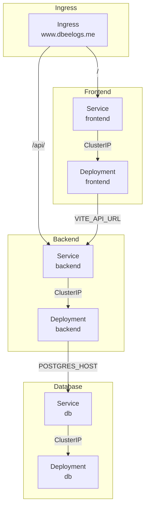

# System Diagram

Let's breakdown the system as a whole which has:
1. Frontend: view and interact with logs
2. Backend: serves up the database layer with a RESTFUL interface
3. DB: the database itself

